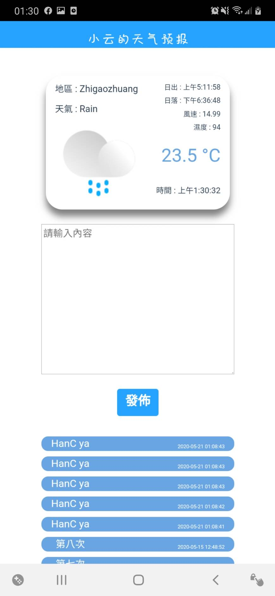

# Weather forecast app

## 專案目的
- 結合vue.js和cordova，製作天氣預報app
- 熟悉開發流程與架構

---

## 專案成果樣式

## 軟體功能
- 即時顯示所在地天氣
- 討論區

--- 
### 安裝Hybrid App
- [詳細文件](./Docs/InstallApp_Q&A.md)

### 專案開發及測試
- [詳細文件-Nelson版本](./Docs/FrontendDev.md)

- [詳細流程-Gigi版本](./Docs/Gigidev.md)

---
## 使用之套件

### Vue.js
- 說明 : 
    1. 能快速搭建好一個SPA的網頁
    2. 各個模版間的的角色定位明確

- component & plugin 使用中
    1. [Mint UI](https://mint-ui.github.io/#!/zh-cn)
    2. [vue-axios](https://vuejs.org/v2/cookbook/using-axios-to-consume-apis.html)：API運用
- component & plugin 未來方向
    1. [vue-i18n](https://kazupon.github.io/vue-i18n/introduction.html#%F0%9F%A5%89-bronze) : 讓App國際化，多國語系套件
    2. [iView modal](https://github.com/iview/iview) : 標準對對話框
    

### Cordova
- 說明 : 將網頁轉換為手機軟體之套件，除了可於專案中加入官方插件外，亦可使用其社群之第三方插件。例如提供網路連線、開啟相機照相之功能。
- [官方網站](https://cordova.apache.org)

### Capacitor
- 說明 : 將網頁轉換為手機軟體之套件，持續更新，將可能取代Cordova的地位。
- [官方網站](https://capacitorjs.com)

---

## Troble shooting

  1. [Android 權限問題](./Docs/AndroidAuthority.md)
  2. [Android SDK/Gradle]() 
